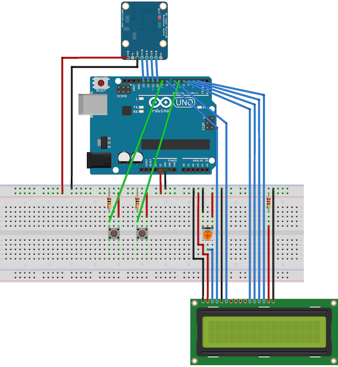
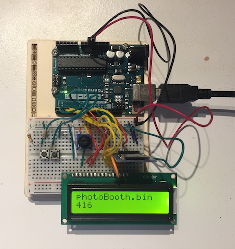

# UnoDucky

This Arduino project mimics the functionalities of the [USB Rubber Ducky](https://github.com/hak5darren/USB-Rubber-Ducky) using the parts present in the [Arduino starter kit](https://store.arduino.cc/genuino-starter-kit) (and a SD Card reader).

In short, this Arduino circuit, once it's plugged to a computer, lists the ducky scripts loaded on the SD card inserted in the card reader on the LCD screen and allows you to choose among these the one(s) to run. 


The project contains three main parts:

- a ducky script encoder written in python. It encodes the ducky script into a bytecode used by the Arduino;
- the Arduino circuit;
- the Arduino software (sketch).


**Disclaimer**: this project was made for fun, and is not really usable, it's just functional. It wasn't effectively tested and contains probably a lot of "features" (especially among the keyboard layouts).


## Usage

### Requirements

- 1 Arduino Uno
- 1 LCD Screen
- 2 buttons
- 1 SD Reader 
- 1 potentiometer
- n wires


The SD Reader is the only component not included in the Arduino Starter Kit.


### Running procedure

The first obvious step is to build the circuit. Once it's done, you can start uploading the sketches. To be sure everything is correctly wired, you can upload the test codes contained in the [`arduino/tests/`](arduino/tests) folder.

Assuming you've assembled the circuit, the procedure to run a ducky script is as follow: 

1. Upload the sketch [ducky_arduino.ino](arduino/src/ducky_arduino/ducky_arduino.ino) using the Arduino IDE
2. Change the firmware of the Arduino with the [Arduino-keyboard-0.3.hex](arduino/firmwares). Using [dfu-programmer](https://dfu-programmer.github.io), follow the following steps:
	1. Put the Arduino in [DFU mode](https://www.arduino.cc/en/Hacking/DFUProgramming8U2)
	2. Run the following commands (adapt the path of the HID firmware according to your working directory): 
	
		```bash
		sudo dfu-programmer atmega16u2 erase
		sudo dfu-programmer atmega16u2 flash arduino/firmwares/Arduino-keyboard-0.3.hex # Genuino-usbserial-atmega16u2-Uno-	R3.hex  
		sudo dfu-programmer atmega16u2 reset
		```

3. Encode & upload your ducky scripts on a SD card
	1. Run the [encoder.py](encoder/encoder.py) python3 script with the ducky script as argument:
	
		```sh
		python3 encoder/encoder.py -i scripts/test.txt
		```
	
		Type `python3 encoder.py -h` to see the complete usage instructions: 
		
		```
		usage: encoder.py [-h] -i INPUT_FILE [-o OUTPUT_FILE] [-l {en_en,fr_be}]
	
		  optional arguments:
		    -h, --help            show this help message and exit
		    -i INPUT_FILE, --input_file INPUT_FILE
	                        Input file
		    -o OUTPUT_FILE, --output_file OUTPUT_FILE
	                        Output filename
		    -l {en_en,fr_be}, --key_layout {en_en,fr_be}
	                        Keyboard layout
		```
	2. The encoder produces a `.bin` file that you have to copy in the root of a micro SD card that you'll insert in the reader.

4. Connect the Arduino to the computer you want to run the script on
5. Use the AN6 button to navigation through the files on the SD card. Those will be listed on the LCD screen
6. Once you found the ducky script you want to run, push the AN9 button.


If you want to update the sketch running on the Arduino, you have to switch its firmware back to the official one. You can find the last version on [this repo](https://github.com/arduino/Arduino/tree/master/hardware/arduino/avr/firmwares/atmegaxxu2).


## Project structure

### Arduino

Everything related to the Arduino (circuit, code & firmware) is in the [arduino](arduino) folder.


##### Harware

The schematics for the circuit are in the [arduino/board.fzz](arduino/board.fzz) file. They were draw using [fritzing](http://fritzing.org).

Here's an png version (click for larger resolution):

[](images/schema.png)

The assembled circuit looks like this: 

[](images/photo.jpg)


##### Software

The Arduino software is supposed to be executed with the HID firmware. Follow the instructions detailed in the **Usage** section to run it.


The software manages the following components: 

- The **LCD screen** shows, one by one, the files (with their sizes) found on the **SD card** inserted in the reader
- The button on the pin **AN6** is to be used to navigate through the files contained in the root directory.
- The other button, on the pin **AN9**, is used to select and run a ducky script

##### Tests

There are .ino's in the [tests](arduino/tests) folder that were created to test independently several part of the circuit (LCD, SDReader, HID firmware). There are more informations about them in the [tests](arduino/tests) folder.


### Encoder

The encoder is written is python. It takes a txt file containing the ducky script as an input and produces a .bin file that's interpretted by the arduino.

Basically, the structure of the .bin , each formed of 8 bytes according to the HID specification. The only exceptions are for the `DELAY` and the `REPEAT` ducky commands. 

A DELAY command is translated in a 8-bytes chunk with the first byte being `0x07` (this value was arbitrarily chosen) and the 7 other bytes encoding the delay value.

A REPEAT command copies the previous encoded command as many times as it as to be repeated. This is indeed the easiest and least efficient implementation possible...


Warning: the binary output of this encode has not the same structure as the output of the official hak5 encoder.


# References

"USB Rubber Ducky", official repo, [https://github.com/hak5darren/USB-Rubber-Ducky](https://github.com/hak5darren/USB-Rubber-Ducky), last access: 05/11/2017

"How to turn Arduino Uno into HID Keyboard", [http://wei48221.blogspot.be/2016/06/arduino-uno-hid-keyboard-joystick-part.html](http://wei48221.blogspot.be/2016/06/arduino-uno-hid-keyboard-joystick-part.html), last access: 05/11/2017

"Arduino USB HID Keyboard", [http://mitchtech.net/arduino-usb-hid-keyboard/](http://mitchtech.net/arduino-usb-hid-keyboard/), last access: 05/11/2017

"HID Usage Tables", [http://www.usb.org/developers/hidpage/Hut1_12v2.pdf](http://www.usb.org/developers/hidpage/Hut1_12v2.pdf) p. 53

"Arduino Tutorial: SD card module Micro SD tutorial DIY", [https://www.youtube.com/watch?v=sS_oW81NweI](https://www.youtube.com/watch?v=sS_oW81NweI) 

put a script.txt file on on an micro-sd card accessible from the arduino. This file could contain a script that tell the arduino what to type. (see the rubber ducky script langage)

send the collected data on a server (via the attacked pc)

save the colected data on a micro-sd card

manage the languages


special firmware for HID + serial : https://github.com/NicoHood/Hoodloader

Micro sd - Arduino 
https://www.youtube.com/watch?v=sS_oW81NweI

Note that the keyboard layouts weren’t scrupulously tested. They may contain some error and produce unexpected results. Please open an issue if you happen to find one.


# TODO

- Fix & complete the keyboard layouts (+ add new ones)
